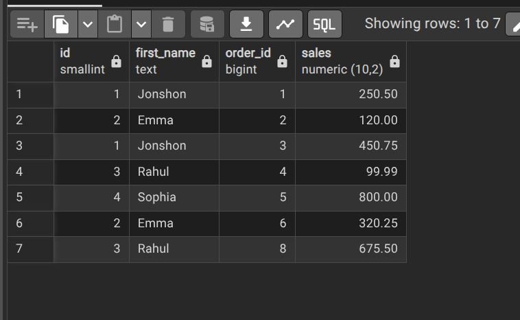
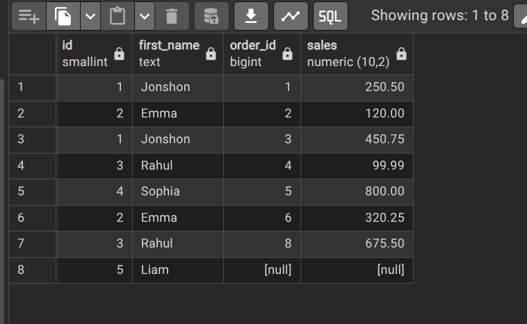
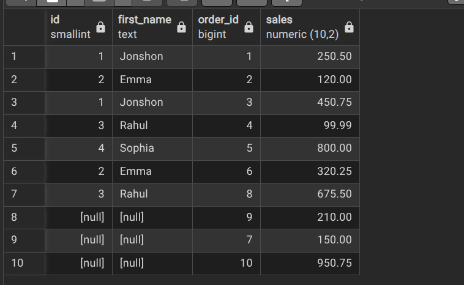
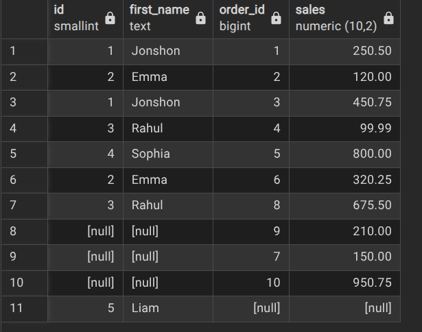
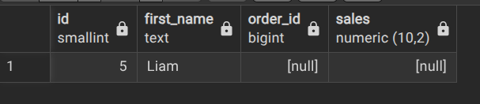
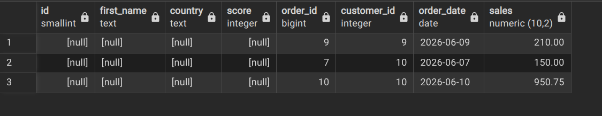
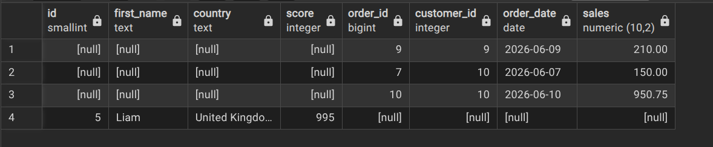
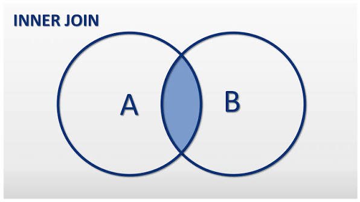
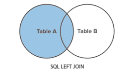
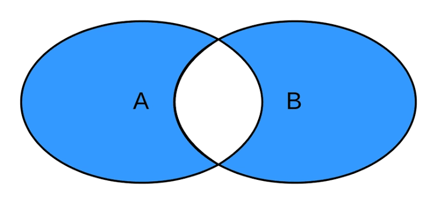

# DATABASE-QUERY

TOPICS

1) [TABLE GENERATION](#table-generation) 
2) [DATA MANIPULATIOn](#data-manipulation-method) 
3) [FILTERS](#filters)
4) [Combining DATa](#combine-data)
### TABLE GENERATION

***QUERY***

```sql
CREATE TABLE persons (
	id INT GENERATED ALWAYS AS IDENTITY,
	person_name VARCHAR(50) NOT NULL,
	birth_date DATE,
	phone VARCHAR(15) NOT NULL,
	CONSTRAINT pk_persons PRIMARY KEY (id)
)
```

---

***SCRIPT GENERATED***

```sql
-- Table: public.persons

-- DROP TABLE IF EXISTS public.persons;

CREATE TABLE IF NOT EXISTS public.persons
(
    id integer NOT NULL GENERATED ALWAYS AS IDENTITY ( INCREMENT 1 START 1 MINVALUE 1 MAXVALUE 2147483647 CACHE 1 ),
    person_name character varying(50) COLLATE pg_catalog."default" NOT NULL,
    birth_date date,
    email character varying(254) COLLATE pg_catalog."default" NOT NULL,
    CONSTRAINT pk_persons PRIMARY KEY (id),
    CONSTRAINT unique_email UNIQUE (email),
    CONSTRAINT veryf_email CHECK (email::text ~* '^[A-Z0-9._%+-]+@[A-Z0-9.-]+\.[A-Z]{2,}$'::text)
)

TABLESPACE pg_default;

ALTER TABLE IF EXISTS public.persons
    OWNER to postgres;

```

***ALTER TABLE***

```sql
ALTER TABLE persons
ADD  email VARCHAR(254)  NOT NULL,
ADD CONSTRAINT veryf_email CHECK (email ~* '^[A-Z0-9._%+-]+@[A-Z0-9.-]+\.[A-Z]{2,}$');

ALTER TABLE persons
ADD CONSTRAINT unique_email UNIQUE (email)

```

```DELETE TABLE```

```sql
DROP TABLE persons
```
------------------

### DATA MANIPULATION METHOD

***INSERT***

```sql
INSERT INTO users (first_name,country,score) 
VALUES ('Newgate', 'West Blue', 800),
	   ('Luffy', 'East Blue', 500);
```

***COPY FROM ONE TABLE TO ANOTHER***

```sql
INSERT INTO persons (id, person_name, birth_date, phone)
SELECT id, first_name, NULL, 'Unkown' FROM users
```

***UPDATE ROW***

```sql
UPDATE users 
	SET first_name = 'Jonshon',
		score = 330
WHERE id = 1;
```

***DELETE ROW***

```sql
DELETE FROM users
WHERE id = 9
```

***DELETE ALL DATA FROM TABLE***

```sql
 TRUNCATE TABLE persons
```

----------------------
### FILTERS

***WHERE Operators***

- Comparison operators
    ```sql
    =
    <
    >
    !=
    >=
    <=
    ```
- Logical Operators
    ```sql
    AND
    OR
    NOT

    -- AND:
    SELECT * FROM users
    WHERE country != 'Canada' AND score > 300;

    -- OR:
    SELECT * FROM users
    WHERE country != 'Canada' OR score > 300;

    -- NOT:
    SELECT * FROM users
    WHERE NOT score < 500
    -- The not operator just give us opposite result
    ```
- Range Operators
    ```sql
    BETWEEN

    -- BETWEEN:
        SELECT * FROM users
        WHERE score >= 200 AND score <= 600
        -- or
        SELECT * FROM users
        WHERE score BETWEEN 200 AND 600
    ```
- Membership Operators
   ```sql
    IN
    NOT IN

    -- IN  -> Check if value exist in list :
        SELECT * FROM users
        WHERE country = 'Canada' OR country = 'India';
        -- OR
        SELECT * FROM users
        WHERE country IN ('Canada','India');

    -- NOT IN  -> Check if value does not exist in list :
        SELECT * FROM users
        WHERE country != 'Canada' AND country != 'India';
        -- OR
        SELECT * FROM users
        WHERE country NOT IN ('Canada','India');
   ```
- Search Operators
   ```sql
    LIKE

    -- Pattern -> 
    -- 1) % -> Any result before or after or between
    -- 2) _ -> Exact result

    -- %
    -- Last two character must end with ia
    SELECT * FROM users
    WHERE first_name LIKE '%ia'

    -- or name starts with E
     SELECT * FROM users
    WHERE first_name LIKE 'E%'
     -- or name has r in middle
     SELECT * FROM users
    WHERE first_name LIKE '%r%'


    --- _ in this case the two __ expects two words before h and any word after h 
    -- ex : Rahul, John, 
     SELECT * FROM users
    WHERE first_name LIKE '__h%'
   ```
   --------------

### COMBINE DATA

- ***JOINS*** -> for joining columns
    - [Inner JOIN](#inner-join)
    - [Full JOIN](#full-join)
    - [LEFT JOIN](#left-join)
    - [Right JOIN](#right-join)
    - [LEFT ANTI JOIN](#left-anti-join)
    - [RIGHT ANTI JOIN](#right-anti-join)
    
- ***SET OPERATORS*** -> for joining rows
    - UNION
    - UNION ALL
    - EXCEPT(MINUS)
    - INTERSECT 
        

#### Inner JOIN
```sql
SELECT 
users.id, 
users.first_name, 
orders.order_id, 
orders.sales 
FROM users 
INNER JOIN orders ON users.id = orders.customer_id

--- or since the table might be long we can shorter with using alias

SELECT 
u.id, 
u.first_name, 
o.order_id, 
o.sales 
FROM users AS u
INNER JOIN orders AS o ON u.id = o.customer_id 
```


#### LEFT JOIN
GET all customers with orders including without orders

```sql
SELECT 
u.id,
u.first_name,
o.order_id,
o.sales
FROM users  AS u
LEFT JOIN orders AS o ON u.id = o.customer_id
```


#### RIGHT JOIN

```sql
SELECT 
u.id,
u.first_name,
o.order_id,
o.sales
FROM users AS u
RIGHT JOIN orders AS o 
ON u.id = o.customer_id
```


#### FULL JOIN

```sql
SELECT 
u.id,
u.first_name,
o.order_id,
o.sales
FROM users AS u
FULL JOIN orders AS o 
ON u.id = o.customer_id
```   



#### LEFT ANTI JOIN

Returns ROW from left that has No match in right <br>
ex: Get any customer who have not place any orders

```sql
SELECT 
u.id,
u.first_name,
o.order_id,
o.sales
FROM users AS u
FULL JOIN orders AS o 
ON u.id = o.customer_id
WHERE o.customer_id IS NULL
```


#### RIGHT ANTI JOIN
GET all order without matching customers

```sql
SELECT 
*
FROM users AS u
RIGhT JOIN orders AS o 
ON u.id = o.customer_id
WHERE u.id IS NULL
```


#### FULL ANTI JOIN

```sql
SELECT 
*
FROM users AS u
FULL JOIN orders AS o 
ON u.id = o.customer_id
WHERE 
u.id IS NULL
OR
o.customer_id IS NULL
```


#### CROSS JOIN

Generate all possible combinations of customers and orders

```sql
SELECT 
*
FROM users
CROSS JOIN orders
```

### HOW TO CHOOSE
- Only matching -> 
    - Inner Join
    
- All rows
    - one side -> left join
    
    - Both sides -> Full join
- Only unmatching 
    - one side -> left anti join
    
    - both side -> full anti join
        
-----

#### Joining mutiple table
[More details](./sales/query.md)
```sql
SELECT
o.order_id, 
o.sales, 
o.order_status, 
c.first_name AS customer_firstname,
c.last_name AS customer_lasttname,
c.customer_id, 
p.product_id, 
p.product,
p.price,
e.first_name as sales_person_first_name,
e.last_name as sales_person_last_name
FROM orders as o
LEFT JOIN customers as c
ON
o.customer_id = c.customer_id
LEFT JOIN products as p
ON
o.product_id = p.product_id
LEFT JOIN employees as e
ON
o.salesperson_id = e.employee_id

```
------------
RULES
1) Rule 1
- SET Operators can be used almost in all clauses 
WHERE | JOIN | GROUP BY | HAVING

2) Rule 2
- ORDER BY IS ALLOWED ONLY ONCE AT THE END OF QUERY

    ```sql
    SELECT 
    first_name, last_name 
    FROM customers

    UNION

    SELECT 
    first_name, last_name 
    FROM employees
    ```
    From the above example we can see that the two columns have same number of column which is 2. If extra is added in any of them it will give an error

3) Rule 3
- The data types needs to be same

4) Rule 4
- The column needs to be in same column so if first is text and union is int it wont work
it both needs to be a text data type

5) The first query controls the heading name so we should add an alias in the first query
    ```sql
    SELECT 
    first_name AS id, 
    last_name AS LAST_NAME
    FROM customers

    UNION

    SELECT 
    first_name, last_name 
    FROM employees
    ```

#### UNION
Returns no duplicate data
task: combine the data from employees and customers into one table

```sql
SELECT 
first_name, last_name 
FROM customers

UNION

SELECT 
first_name, last_name 
FROM employees
```

#### UNION ALL
Combines all duplicates as well

task: combine the rows of customers and employee including the duplicates
```sql
SELECT 
first_name, last_name 
FROM customers

UNION ALL

SELECT 
first_name, last_name 
FROM employees
```

#### EXCEPT
Returns all distinct rows from the first query that are not found in the second query.

-----
[TOP](#database-query)